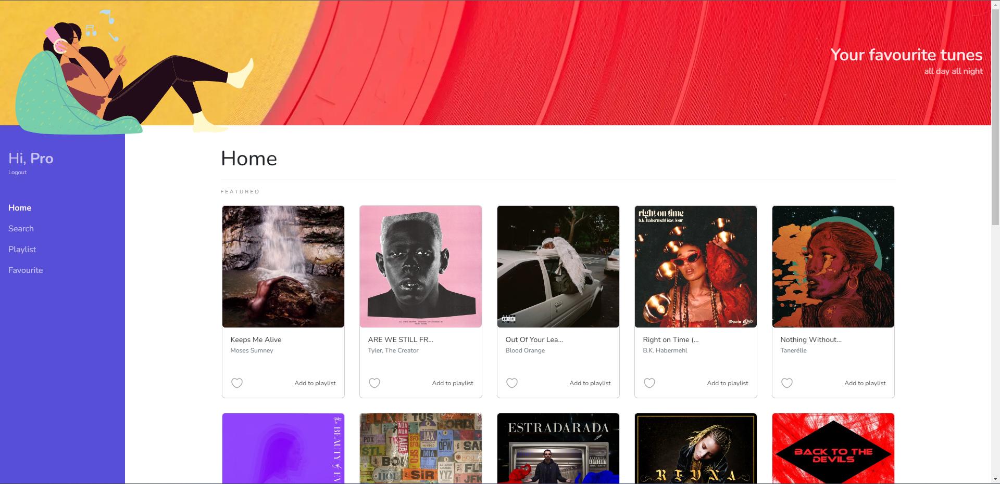
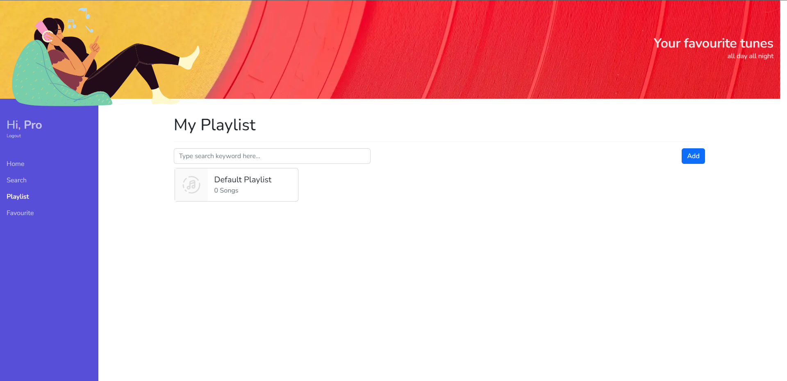
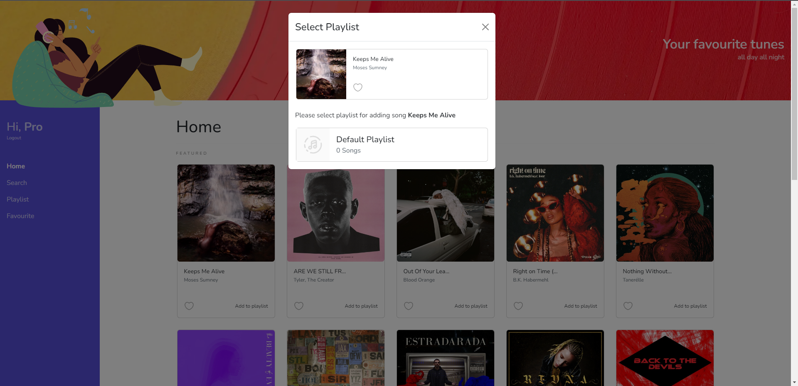
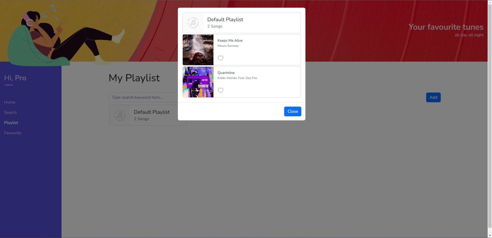
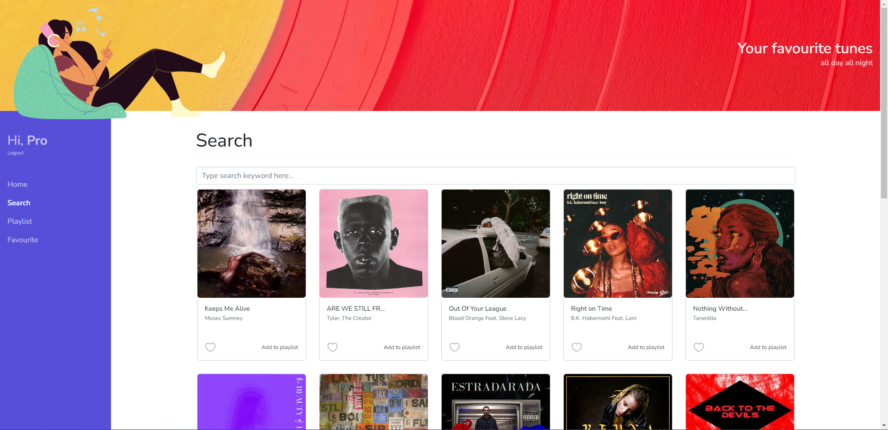
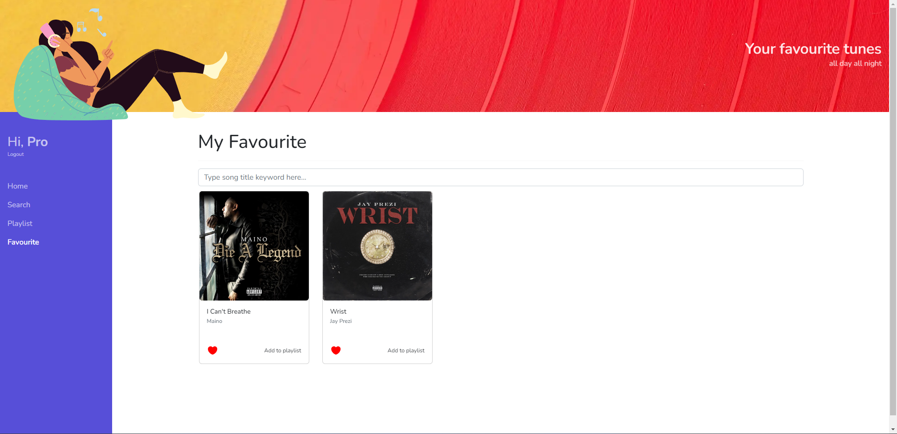
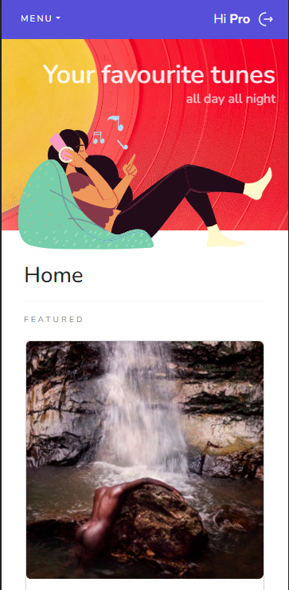

## Getting Started

### Env variable

First, create .env.local file in root directory, then add some variable:

```
NEXT_PUBLIC_RAPID_API_KEY=YOUR_RAPID_API_KEY
NEXT_PUBLIC_KEYCLOAK_CLIENT_ID=YOUR_KEYCLOAK_CLIENT_ID
NEXT_PUBLIC_KEYCLOAK_CLIENT_SECRET=YOUR_KEYCLOAK_CLIENT_SECRET
NEXT_PUBLIC_KEYCLOAK_URL=YOUR_KEYCLOAK_URL
NEXT_PUBLIC_KEYCLOAK_REALM=YOUR_KEYCLOAK_REALM
```

### Keycloak

Create an openid-connect client in Keycloak with "confidential" as the "Access Type".

### Run

First, run the development server:

```bash
npm run dev
# or
yarn dev
# or
pnpm dev
```

Open [http://localhost:3000](http://localhost:3000) with your browser to see the result.

### Screenshots

#### Home page



#### Playlist page



#### Add song to playlist



#### Playlist detail



#### Search



#### Favourite



#### Mobile view


